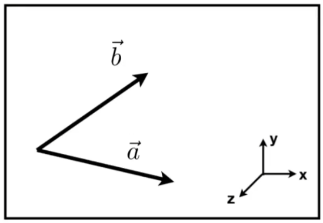

# Games101笔记
## 1、图形学中一般向量表示为列向量
## 2、当一个坐标系的坐标轴存在$x\times y=z$，则称该坐标系为右手坐标系，注意课程中默认坐标系为右手系，而OpenGL等图形API中默认为左手坐标系，也即$x\times y=−z$的坐标系.
## 3、向量叉乘的应用：
* 判断左右，例如，在右手系的XOY平面上，若两个向量，有的结果的分量为正，则在左边，否则在右边。
