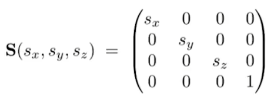
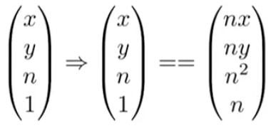

# Games101笔记
# **Leture01~Leture03**
## 1、图形学中一般向量表示为列向量
## 2、当一个坐标系的坐标轴存在，则称该坐标系为右手坐标系，注意课程中默认坐标系为右手系，而OpenGL等图形API中默认为左手坐标系，也即的坐标系.
## 3、向量叉乘的应用：
* 判断左右，例如，在右手系的XOY平面上，若两个向量，有的结果的分量为正，则在左边，否则在右边。

   
* 进而，可以利用上述性质判断一个点是否在三角形的内部（用于光栅化）

   例如，对于逆时针描述的三角形ABC，若AP在AB左侧，BP在BC左侧，CP在CA左侧，则P在ABC内部，反之若任意AP、BP、CP在对应边的右侧，则认为其在三角形外。

  当然若按顺时针A-C-B的顺序构造三角形，则需满足AP，CP，BP分别在AC，CB，BA的右侧。
  所以，判断一个点是否在三角形内侧，可以通过判断它与顶点构成的向量是否均在三条对应边的同侧（逆时针为左侧，顺时针为右侧）来实现。

  
## 4、2D矩阵变换与齐次变换
>注：该部分内容结合《线性代数的本质》可深入理解
* 结合《线性代数的本质》中对线性变换的定义：

    变换后的坐标系原点位置不变并且“网格线”平行且等距分布，将2D变换分为**线性变换**：**旋转**，**缩放**，**剪切**以及**非线性变换**：**平移**（坐标原点发生了改变），线性变换与平移加起来都叫做**仿射变换**。
 ### **4.1 线性变换**：旋转（rotate） 缩放（scale） 剪切（shear）
* 直接将变换后的$x$轴与$y$轴基向量作为变换矩阵的两个列向量即得到变换矩阵：
	（方法见《线性代数的本质》）
	
    **旋转**：

    

    **缩放**：

    

    **剪切**：

    
### **4.2 平移变换**：升维——>引入第三个维度：

	
这里第三个坐标只对点有用（为1），对向量没用（为0），因为向量具有平移不变性.

>**注：对于一个平移与线性变换组合的矩阵，其表示的是先线性变换后平移变换：** 
> 

* 形象理解：

    上述变换实际是将向量空间由二维坐标映射到了三维空间，然后做了一个X，Y轴不变(或线性变换)，使Z轴向XOY平面靠近/远离的剪切操作：

    

    	
	对应point也跟随坐标系的位置发生了剪切变化：坐标仍为1，坐标与坐标跟随基向量分别改变了与 。此时其横坐标与纵坐标就分别是 与 。
* 为什么第三个坐标对point是1，对vector是0？：

   

    容易看出，这很方便定义上述的三种操作：0+0=0；1-1=0；1+0=1

    那么point+point的结果1+1=2如何解读呢？对这一操作有：

    

    因此point+point得到的结果就是这两个点的中点。

# **Leture 04: Transfromation cont.**
## 5、正交矩阵特性解读与旋转矩阵

>正交矩阵的特性：\
1、**矩阵每列向量与自己点乘为1，与其他列向量之间点乘为0。**\
2、对于正交矩阵,其与转置矩阵相乘对角线上元素为列向量自乘，非对角线元素为列向量互乘，因此。也即：**正交矩阵的逆矩阵与转置矩阵相同**。

将正交矩阵看作应用于任一列向量上的线性变换，则基于上述**特性1**，变换的后的向量空间的基向量满足1）单位向量、2）相互正交。因此，显然**单一的旋转变换是正交变换**，同样容易想到，**镜像变换（将某一基向量方向取反）也是正交变换**。

正交矩阵的**特性2**可应用于旋转矩阵的逆变换——已知某个旋转矩阵, 其对应的逆旋转变换与转置矩阵相同：。

## 6、三维变换与对应齐次坐标

三维变换与二维变换的齐次坐标一样，在点或者向量后面再加一位，1（末尾有效）代表点，0（末尾无效）代表向量。\
 \
与之对应的，三维变换对应的变换矩阵也就是4*4的矩阵：\

* **缩放**\

* **平移**\

* **旋转**\
\
显然，三维空间中绕某一坐标轴的旋转矩阵，是该坐标轴作为基向量不变，另外两个基向量在对应基平面内进行二维旋转所构成的。
    > 注：**绕Y轴旋转后得到的基向量与绕其他轴得到的基向量互逆，这是因为X轴与Z轴构成的基平面是ZOX平面而非XOZ平面，实际的旋转空间中坐标轴的顺序与4*4矩阵中坐标轴的排列顺序相反。**

* **复合旋转**

    * **欧拉角（Euler angles）**

        

        **Pitch（抬头低头）、Roll（沿轴翻滚）、Yaw（左右旋转）**:

        

    * **欧拉角（Euler angles）**    
    * **罗德里格斯旋转公式（Rodrigues' Rotation Formula）**

        

        该公式表示了围绕 **经过坐标原点的轴** 旋转角度的旋转矩阵。

        >注：如果想绕不经过坐标原点的轴旋转，则应该先将旋转轴平移变换到坐标原点处，然后应用罗德里格斯旋转矩阵，然后再平移回原来的位置。

        推导：

        

        

        >注：注意体会推导Step1过程中向量点积与矩阵变换对偶性的应用；以及公式最后一项N为向量叉积的矩阵表示形式。
    * **四元数** 待补充——————————————————————————————————————————————————————————————————————————————————————————————————————————————————————————————————————————————————————————————————————

## 7、Viewing Transformation（观测变换）
### 7.1 **Model Transformation(模型变换)**
### 7.2 **View/Camera Transformation(视图变换)**
* **定义相机**

    position：相机的**位置向量**

    Look At Direction：相机的**朝向**

    Up Direction：相机的**法向量**(与正交)

    

* **将物体坐标变换到相机视角**

    想象相机和物体都处在世界坐标系下，相机和物体的位置都是依据世界坐标系而言的。

    我们现在要做的事情就是将物体的位置用相机的视角描述，这本质上是**世界坐标系**到**相机坐标系**（相机为原点，轴为，轴为，轴为）的坐标变换。

    

    由于相机位置与坐标原点并不重合，无法直接使用基变换，因此首先要将相机与物体同时移动，

    

    然后应用基变换矩阵：

    

    > 注：基变换相关知识可参考《线性变换的本质》，设物体在相机坐标系下的向量坐标为, 在世界坐标系下向量坐标为，那么存在基变换，能够将向量在相机坐标系中的描述转变为世界坐标系下的描述，即，那么显然，的列向量由、、组成。而我们要求的从世界坐标系到相机坐标系的基变换矩阵应满足，所以显然(这一步的基变换只涉及旋转，而前面讲过，旋转矩阵是正交的)。

### 7.3 **Projection Transformation(投影变换)**：3D->2D

* **正交投影(Orthographic)**

    通过[l,r],[b,t],[f,n]六个值定义了一个空间中的长方体，然后将它投影到一个中心位于原点的的正方体上，

    

    > 注1：摄像机沿 **-Z** 方向朝物体看去，因此f(far)相比n(near)要离得原点近；

    > 注2：这也正好解释了之前的视图变换中摄像机的LookAt向量为何对应 **-Z** 方向，这是因为在 **右手系** 中，朝 **-Z** 方向看去看到的正好是XOY坐标系，取得物体的正交投影只要去掉物体投影变换后的Z坐标就可以了。也正因如此，OpenGL等图形API中使用的是**左手系**。

    > 注3：注意理解投影变换与视图变换的不同作用，上图中空间中的长方体就是摄像机能够呈相的全部区域，因此正好要投影到的正方体上。(存疑)

* **透视投影(Perspective)**

   为了方便理解，我们将透视投影分为两步，一是**挤压**/**裁剪**，变换用矩阵表示，二是正交投影，变换用来表示。

    

   * **挤压**

        挤压是将由近平面与远平面包围成的楔形体挤压成长方体的过程。

        **近平面上的点坐标保持不变，远平面上的点的坐标保持不变。远平面的中心点保持不变。**

        

        通过图片看到，远平面上点挤压后的与坐标与原坐标的比例关系可通过相似三角形得到。
        
        从而从近平面到远平面上任意一点的坐标经过挤压有如下变换：
        
        

        > 注：为什么要变换后的坐标要乘，这是为了使之后的投影变换矩阵中不出现变量，从而方便计算机的存储和运算。

        根据变换的前后坐标，容易写出不完全的变换矩阵：

        

        > 注：最后一行为什么是,而不是，这与上一个注中的理由相同，就是投影矩阵中不应该出现变量。而这一步之所以能这样表示也是因为在上一步中的齐次坐标乘了。

        现在只需要求投影矩阵的第三行：依旧通过能够确定的点坐标进行反推：

        对于近平面上的点，有：，所以可以确定其变换前后的坐标：

        

        变换后的坐标为，与、无关，那么其对应的挤压矩阵的第三行的前两个数一定是0，那么还只需求和：

        

        这时需要另外一个约束条件，远平面上的点的坐标也不变，从而有：

        

        从而解出：

        

        将其带回挤压矩阵，再乘以正交投影矩阵就可以得到透视投影矩阵：

    
        ortho}=\begin{pmatrix}n&0&0&0\\0&n&0&0\\0&0&n&plus;f&-nf\\0&0&1&0\\\end{pmatrix}" width=400px> .

         
        
        > **透视投影中只有近平面与远平面的坐标不变，位于二者之间平面上的点的坐标应该怎样变换呢？**

        >对于近平面与远平面中任意一点，对其应用挤压变换有：\
        

        >将其第三项与原坐标对比，0" title="n+f-nf/z-z=-(z-f)(z-n)/z>0" />，所以经过挤压的中间点相比原来要更加靠近近平面(在右手系中，相机朝向为轴，所以点的坐标越大距离相机越近)。

        >事实上，这一结果也符合“挤压”的形象理解，想象一下，保持小端不变，挤压一块楔形海绵的大端，是不是除了横向位移固定的大端和小端平面，内部所有的点都有向小端横向移动的倾向？

        

